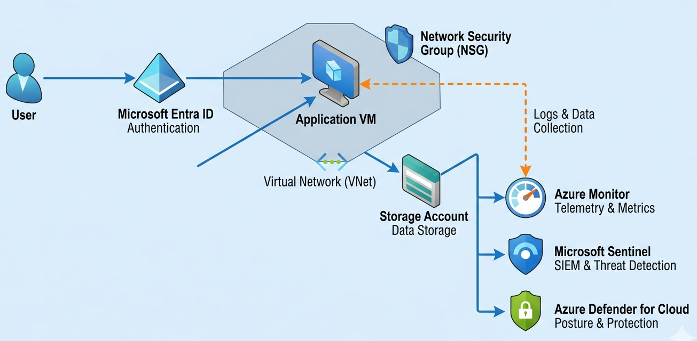
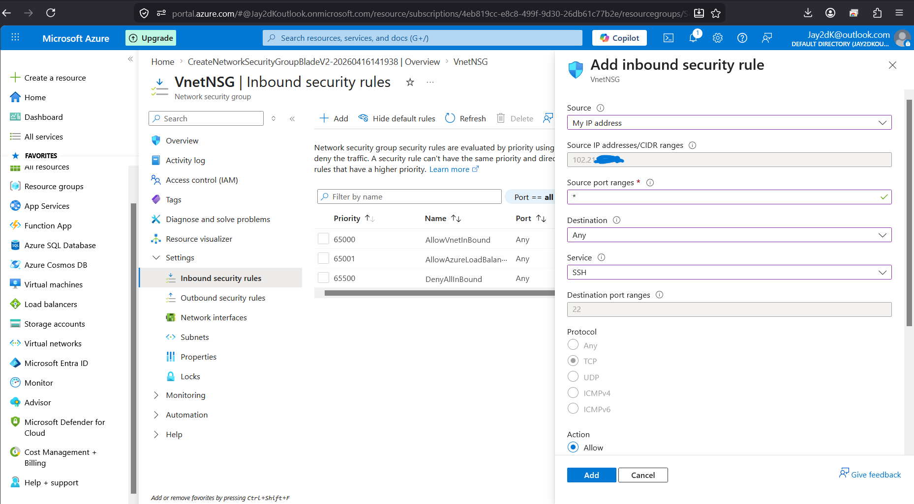
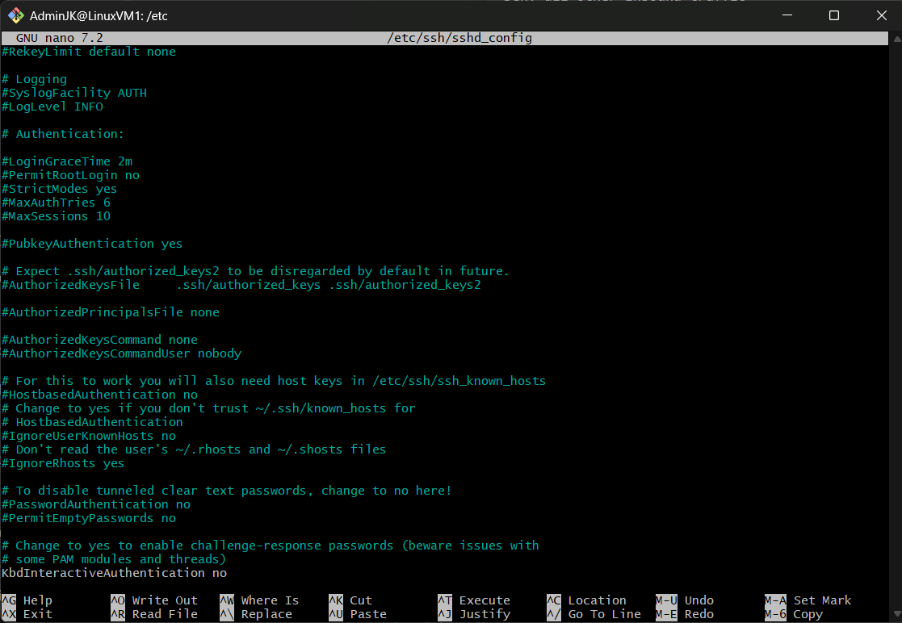
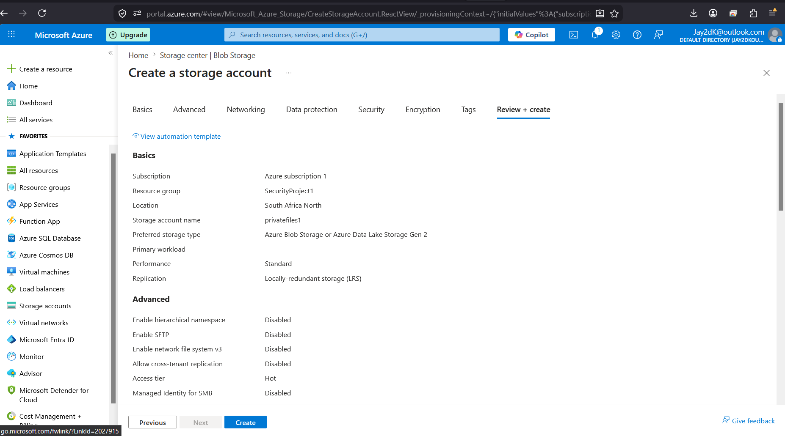
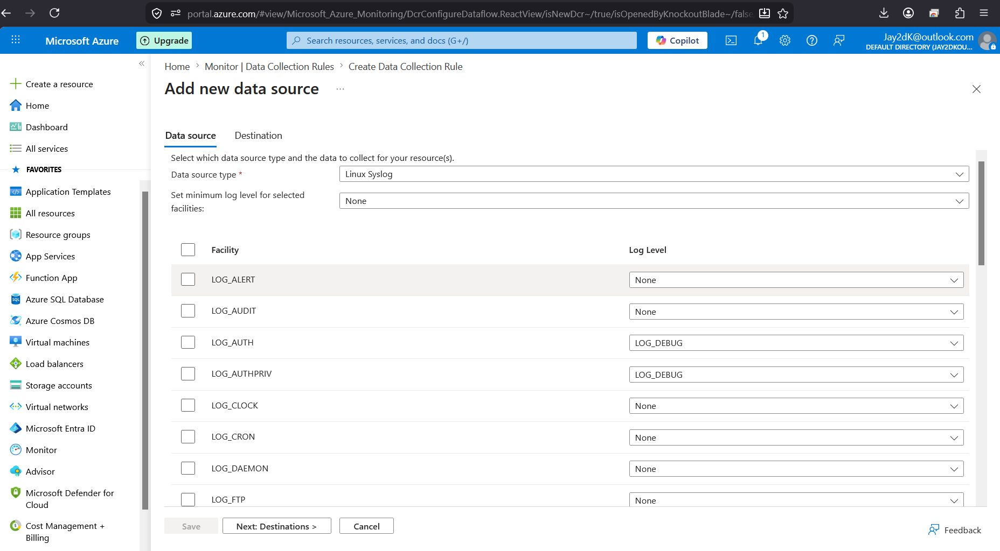
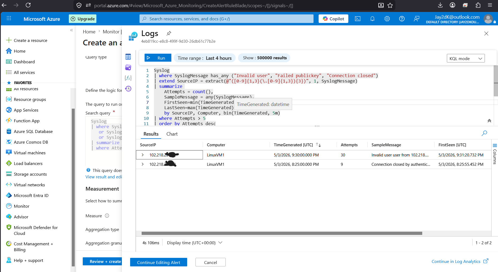

# azure-cloud-security-lab
This project demonstrates how to design and implement a secure cloud environment in Microsoft Azure using best practices in identity management, network security, monitoring, and threat detection.

## 🎯 Objectives
- Implement secure Identity & Access Management
- Build segmented network architecture
- Deploy and harden a Linux VM
- Secure Azure Storage
- Enable monitoring and logging
- Integrate SIEM using Microsoft Sentinel
- Simulate and respond to security incidents

---

## 🏗️ Architecture

---

🔐 1. Identity & Access Management

### 🛠️ Steps

#### Create User
1. Go to Microsoft Entra ID → Users → New user  
2. Enter username, name, password  
3. Click Create  

#### Create Group
1. Microsoft Entra ID → Groups → New group  
2. Type: Security  
3. Name: SecurityTeam  
4. Add user  

#### Assign Roles
1. Subscriptions → Access Control (IAM)  
2. Add role assignment  
3. Assign:
   - User Administrator  
   - Contributor  

#### Enable MFA
1. Entra ID → Security → Conditional Access  
2. Create policy → Require MFA  

---

🌐 2. Network Security

### 🛠️ Steps

#### Create VNet
1. Virtual Networks → Create  
2. Address space: 192.168.0.0/16  

#### Create Subnets
- Public: 192.168.1.0/24  
- Private: 192.168.2.0/24  

#### Configure NSG
- Allow SSH (22) from your IP  
- Deny all others  

📸 Screenshot:  

---

🖥️ 3. Virtual Machine Hardening

### 🛠️ Steps

1. Create Linux VM (Ubuntu)  
2. Select SSH key authentication  
3. Place in VNet  

### 🔐 Hardening

'''bash
sudo nano /etc/ssh/sshd_config
Set:
PermitRootLogin no
PasswordAuthentication no
sudo apt update && sudo apt upgrade -y

📸 Screenshot:  

---

💾 4. Secure Storage
🛠️ Steps
1. Create Storage Account
2. Disable public access
3. Enable HTTPS only
4. Disable anonymous access

📸 Screenshot:

---

📊 5. Logging & Monitoring
🛠️ Steps
1. Create Log Analytics Workspace
2. Install Azure Monitor Agent
3. Configure Data Collection Rule
4. Enable Syslog (auth, authpriv)

📸 Screenshot:

---

🛡️ 6. Threat Detection
🛠️ Steps
1. Enable Microsoft Defender for Cloud
2. Turn on Defender for Servers
3. Review recommendations
4. Fix:
- Open ports
- Missing updates

---

🧠 7. SIEM Setup (Microsoft Sentinel)
🛠️ Steps
1. Add Log Analytics Workspace to Sentinel
2. Enable Data Connectors
3. Create detection rule
- 🔍 Detection Query
Syslog
| where SyslogMessage has_any ("Invalid user", "Failed publickey", "Connection closed")
| extend SourceIP = extract(@"([0-9]{1,3}(\.[0-9]{1,3}){3})", 1, SyslogMessage)
| summarize 
    Attempts = count(),
    FirstSeen = min(TimeGenerated),
    LastSeen = max(TimeGenerated),
    SampleMessage = any(SyslogMessage)
    by SourceIP, Computer, bin(TimeGenerated, 5m), _ResourceId
| where Attempts > 5

📸 Screenshot:

---

🚨 8. Incident Simulation
- 🧪 Actions
- Attempt multiple failed SSH logins
- Access restricted ports
- 🔍 Investigation
Syslog
| where SyslogMessage has_any ("Invalid user", "Failed publickey", "Connection closed")

📸 Screenshot:

📸 Screenshot:

---

🚫 Response
- Identified attacker IP
- Blocked using NSG rule
- 🔁 Incident Response Workflow

Attack → Detection → Investigation → Response

---

✅ Key Security Principles
- Least Privilege
- Defense in Depth
- Network Segmentation
- Monitoring & Alerting
